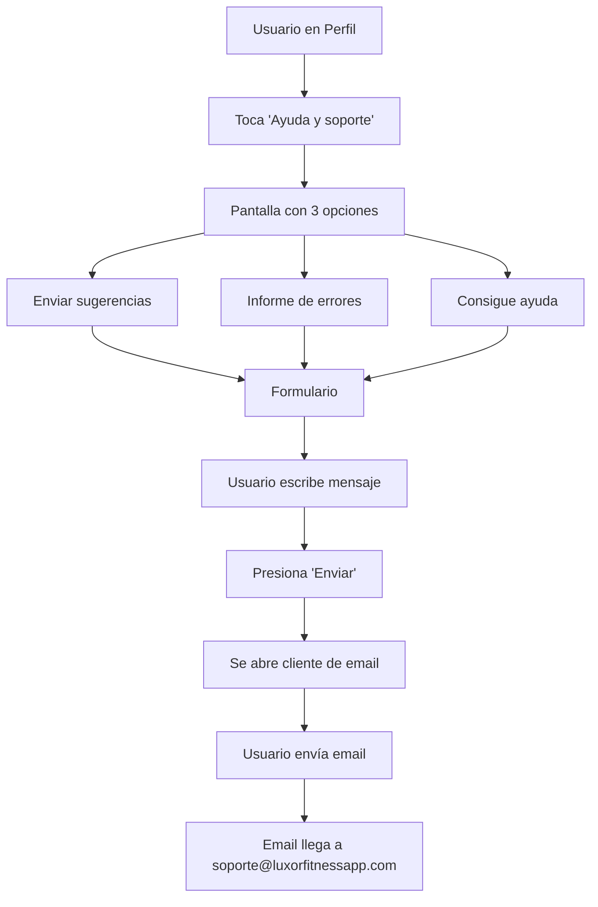

# 🆘 Ayuda y Soporte - Documentación

## 📋 Descripción

Sistema de ayuda y soporte integrado en la app que permite a los usuarios:
- Enviar sugerencias
- Reportar errores
- Solicitar ayuda

Todos los mensajes se envían a: **soporte@luxorfitnessapp.com**

---

## 🏗️ Estructura

### Pantallas Creadas

1. **`app/help.tsx`** - Pantalla principal con 3 opciones
2. **`app/support-form.tsx`** - Formulario de contacto

### Flujo de Usuario

```
Perfil → Ayuda y soporte → [Elegir opción] → Formulario → Enviar email
```

---

## 📱 Pantalla 1: Ayuda y Soporte (`app/help.tsx`)

### Características:

- **3 Opciones de contacto:**
  1. **Enviar sugerencias** 💡
     - Icono: `bulb-outline`
     - Placeholder: "Cuéntanos tu idea o sugerencia para mejorar Fitness Luxor App..."
  
  2. **Informe de errores** 🐛
     - Icono: `bug-outline`
     - Placeholder: "Describe el error que encontraste..."
  
  3. **Consigue ayuda** ❓
     - Icono: `help-circle-outline`
     - Placeholder: "¿En qué podemos ayudarte?..."

- **Diseño:**
  - Header con icono de chat
  - Tarjetas con iconos grandes y descripciones
  - Email de contacto visible
  - Footer informativo (respuesta en 24-48h)

### Código Clave:

```typescript
const supportOptions: SupportOption[] = [
  {
    id: 'suggestion',
    title: 'Enviar sugerencias',
    description: 'Comparte tus ideas para mejorar la app',
    icon: 'bulb-outline',
    placeholder: '...',
  },
  // ... más opciones
];
```

---

## 📝 Pantalla 2: Formulario (`app/support-form.tsx`)

### Características:

- **Título dinámico:** Muestra el título de la opción elegida
- **Placeholder personalizado:** Según el tipo de consulta
- **Campo de texto grande:** TextArea multilinea (hasta 1000 caracteres)
- **Contador de caracteres:** Muestra X/1000
- **Información del usuario incluida:** Email, nombre, ID, fecha

### Funcionamiento del Envío:

1. Usuario escribe su mensaje
2. Presiona "Enviar mensaje"
3. Se abre la **app de email del dispositivo** con:
   - **Para:** soporte@luxorfitnessapp.com
   - **Asunto:** [Tipo de consulta] - email@usuario.com
   - **Cuerpo:** Mensaje + información del usuario

4. Usuario envía desde su cliente de email

### Formato del Email Enviado:

```
Para: soporte@luxorfitnessapp.com
Asunto: [Enviar sugerencias] - usuario@email.com

[Mensaje del usuario]

---
Usuario: Roberto Bolla
Email: roberto@email.com
ID: user_34uvPy...
Tipo de consulta: Enviar sugerencias
Fecha: 23/12/2024, 10:30:45
```

### Código Clave:

```typescript
const mailtoUrl = `mailto:soporte@luxorfitnessapp.com?subject=${subject}&body=${body}`;
await Linking.openURL(mailtoUrl);
```

---

## 🎨 Diseño Visual

### Colores:
- Fondo: `#0a0a0a` (negro)
- Tarjetas: `#1a1a1a` (gris oscuro)
- Acento: `#ffb300` (amarillo/dorado)
- Texto primario: `#ffffff`
- Texto secundario: `#888888`

### Componentes:
- ✅ SafeAreaView para iOS
- ✅ KeyboardAvoidingView para el formulario
- ✅ ScrollView para contenido largo
- ✅ StatusBar light-content
- ✅ Iconos de Ionicons

---

## 🔗 Navegación

### Desde Perfil:

```typescript
// En app/(tabs)/profile.tsx (ya existe):
{
  title: 'Ayuda y soporte',
  icon: 'help-circle-outline',
  onPress: () => router.push('/help'),
}
```

### De Ayuda a Formulario:

```typescript
router.push({
  pathname: '/support-form',
  params: {
    type: option.id,
    title: option.title,
    placeholder: option.placeholder,
  },
});
```

---

## ⚙️ Tecnologías Usadas

1. **React Native Linking**: Para abrir el cliente de email
   ```typescript
   import { Linking } from 'react-native';
   ```

2. **Clerk Auth**: Para obtener info del usuario
   ```typescript
   const { user } = useUser();
   ```

3. **Expo Router**: Para navegación entre pantallas
   ```typescript
   import { router, useLocalSearchParams } from 'expo-router';
   ```

---

## 🧪 Pruebas

### Prueba 1: Navegar desde Perfil
1. Abre la app
2. Ve a **Perfil**
3. Toca **"Ayuda y soporte"**
4. Verifica que se abra la pantalla con 3 opciones

### Prueba 2: Enviar Sugerencia
1. Toca **"Enviar sugerencias"**
2. Verifica que el título sea "Enviar sugerencias"
3. Verifica que el placeholder sea apropiado
4. Escribe un mensaje de prueba
5. Toca **"Enviar mensaje"**
6. Verifica que se abra tu cliente de email
7. Verifica que el email esté prellenado correctamente
8. Envía el email

### Prueba 3: Reportar Bug
1. Toca **"Informe de errores"**
2. Verifica icono de bug 🐛
3. Escribe descripción de un bug
4. Envía y verifica formato del email

### Prueba 4: Consigue Ayuda
1. Toca **"Consigue ayuda"**
2. Verifica icono de ayuda ❓
3. Escribe una consulta
4. Envía y verifica formato

### Prueba 5: Validaciones
1. Intenta enviar sin escribir nada
2. Verifica que muestre "Campo vacío"
3. Escribe 1001 caracteres
4. Verifica que solo permita 1000

---

## 📧 Recepción de Emails

Los emails llegarán a **soporte@luxorfitnessapp.com** con el siguiente formato:

### Asunto:
```
[Enviar sugerencias] - roberto@email.com
```

### Cuerpo:
```
Me encantaría que agregaran un modo oscuro más personalizable.

---
Usuario: Roberto Bolla
Email: roberto@email.com
ID: user_34uvPy06sO0wcE3tfZ44DTmuSdX
Tipo de consulta: Enviar sugerencias
Fecha: 23/12/2024, 10:30:45
```

---

## 🔄 Flujo Completo



---

## 🚀 Mejoras Futuras (Opcionales)

1. **Adjuntar capturas de pantalla** (especialmente para bugs)
2. **Sistema de tickets** con seguimiento
3. **Chat en vivo** para soporte inmediato
4. **Base de conocimientos / FAQ** integrada
5. **Envío directo desde la app** (sin abrir cliente de email)
6. **Notificaciones** cuando reciban respuesta
7. **Historial de consultas** del usuario
8. **Rating del soporte** recibido

---

## ✅ Archivos Creados

- ✅ `app/help.tsx` - Pantalla principal
- ✅ `app/support-form.tsx` - Formulario
- ✅ `AYUDA_Y_SOPORTE.md` - Esta documentación

---

## 📝 Notas Importantes

1. **El email se abre en el cliente nativo** del dispositivo (Gmail, Outlook, Mail, etc.)
2. **No se envía automáticamente** - el usuario debe presionar "Enviar" en su app de email
3. **Si no tiene cliente de email configurado**, se muestra un mensaje con instrucciones
4. **La información del usuario** se incluye automáticamente para facilitar el soporte
5. **No se almacena historial** en la app (los emails van directo al cliente)

---

## 🐛 Troubleshooting

### Problema: "No se puede abrir email"
**Solución:** El usuario no tiene configurado un cliente de email en su dispositivo. Se muestra un mensaje alternativo con el email de soporte.

### Problema: El email no incluye la información del usuario
**Solución:** Verificar que el usuario esté autenticado con Clerk y tenga permisos.

### Problema: Los caracteres especiales se ven mal en el email
**Solución:** Ya está implementado el `encodeURIComponent` para el asunto y cuerpo.

---

¡Sistema de ayuda y soporte completamente funcional! 🎉

